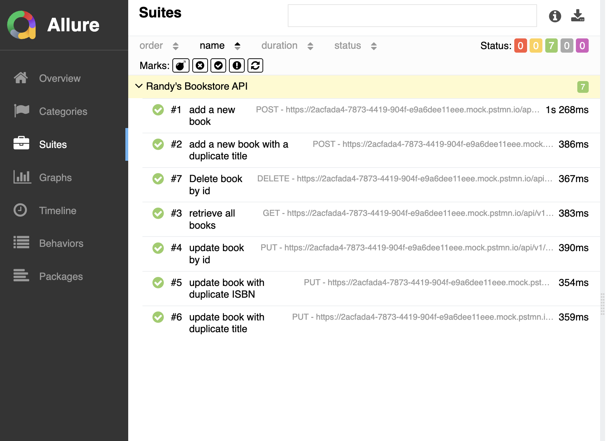
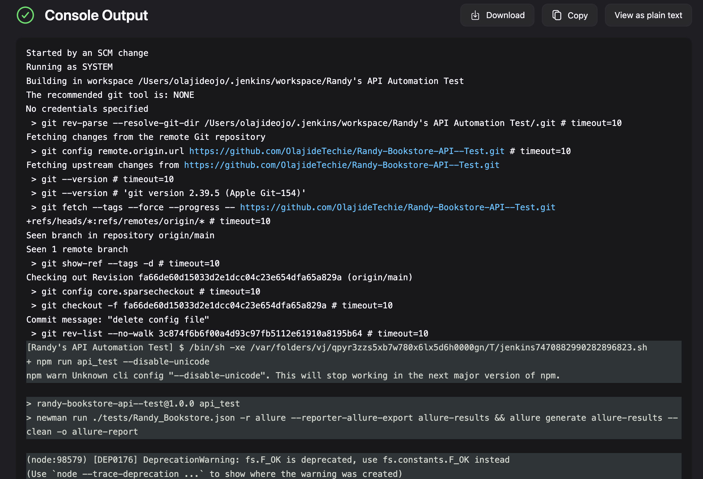
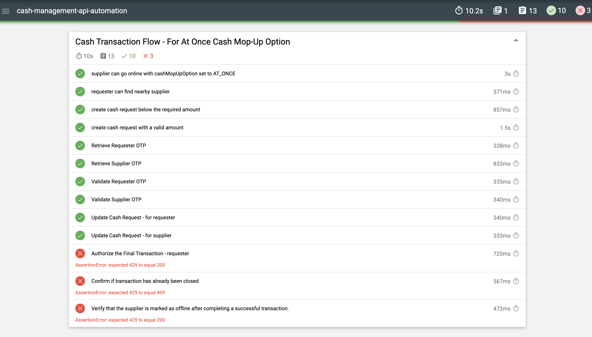
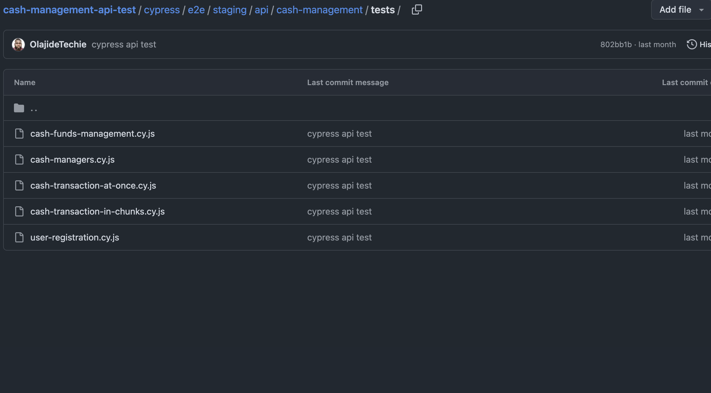

# 👨‍💻 Olajide Ojo

I am a QA Engineering Leader who strongly focuses on building scalable, reliable, and maintainable test automation frameworks across Web, Mobile, and API platforms. My career spans high-impact roles in FinTech, Digital Payments, and Lending, where I’ve helped deliver secure, high-quality products through a strategic and hands-on approach to quality engineering. I thrive in fast-moving environments where quality and innovation intersect and am passionate about mentoring teams, streamlining QA processes, and championing engineering excellence.

---

## 🔍 About Me

- 💼 QA Engineer with experience in cross-functional teams.
- 🔧 Skilled in Appium, WebdriverIO, Cypress, Postman, JMeter, MySQL.
- 📱 Tested and automated mobile apps for both Android and IOS.
- 🚀 Currently setting up a QA automation framework for a new Marketplace initiative.

---

## 📂 Projects

### 1. **API Testing – Postman & Newman**
- **Description**: API testing and validation using Postman for Randy Bookstore APIs.
- **Highlights**:
  - Authenticated flows with request scripts.
  - Automated tests with Postman.
  - Worked with the Postman mock server.
- **Tools**: Postman, Allure Reporter, Jenkins
- **Repo**: [GitHub Link](https://github.com/OlajideTechie/Randy-Bookstore-API--Test.git)
- **AllureReporter**
- **JenkinsResult**

---

### 2. **API Testing – Cypress**
- **Description**: API testing and validation using Cypress for Cash Management APIs.
- **Highlights**:
  - Authenticated flows with request scripts and environment variables.
  - Automated tests with Cypress.
- **Tools**: Cypress, Mochawesome Reporter
- **Repo**: [GitHub Link](https://github.com/OlajideTechie/cash-managment-api-test.git)
- **MochawesomeReporter**
- **GitHubRepoConfig**

  ---

### 3. **Mobile Automation Framework – Appium + WebdriverIO**
- **Description**: End-to-end mobile automation for Android using WebdriverIO with Appium and Typescript.
- **Highlights**:
  - Built a scalable Page Object Model structure.
  - Integrated Allure Reporter for test reports.
- **Tools**: Appium, WebdriverIO, TypeScript, Allure, Android Studio
- **Repo**: [GitHub Link](https://github.com/OlajideTechie/Webdriverio-Mobile-Automation.git)

---

## 🛠️ Skills & Tools

- **Languages**: JavaScript, TypeScript, Python
- **Frameworks**: WebdriverIO, Cypress, JMeter, Postman
- **CI/CD**: GitHub Actions, Jenkins
- **Platforms**: Android Studio, Xcode, Browserstack, API Swagger Docs
- **Reporting**: Allure, HTML Reports, Newman Reporter
- **Testing Practices**: Manual Testing, API Testing (RESTful services), Mobile Testing (iOS & Android), Functional, Regression, Integration Testing

---

## 📄 Resume

Download my [Resume (PDF)](./Olajide_Ojo_QA_Engineer_Resume.pdf)

---

## 🔗 Connect with Me

- 🔗 [LinkedIn](https://www.linkedin.com/in/ojo-olajide/)
- 💻 [GitHub](https://github.com/OlajideTechie)
- 📫 [Email](mailto:oolajide91@gmail.com)

---

> “Quality First At All Times.” – Olajide Ojo
